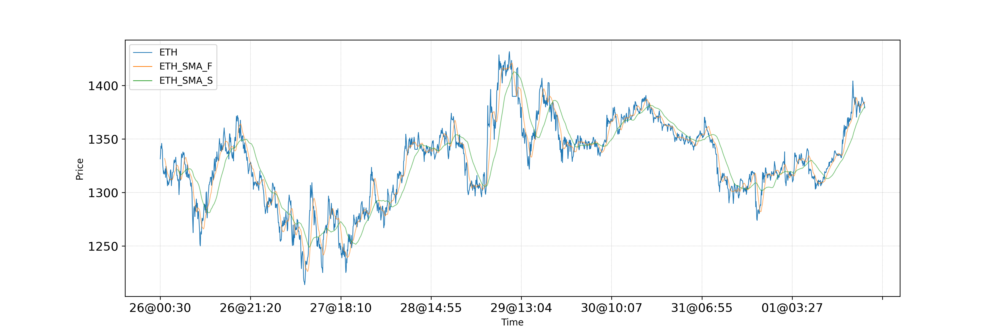

# Robinhood Crypto Trading Bot
A simple Python crypto algotrader 

## Introduction
I've been wanting to play around with algotraders for a while now. After some initial research, I stumbled upon [Jason Bowling's article](https://medium.com/swlh/a-full-crypto-trading-bot-in-python-aafba122bc4e), in which he describes the mechanics of his rudimentary Python bot. His code tickled my curiosity, so I started tinkering with it. In the spirit of open source, I created this public repository to share my experiments with anyone interested in such esoteric stuff.

## Disclaimer
To use Jason's words: cryptocurrency investing is *risky*! Doing it using a computer program is even riskier. Doing it with code you didn’t write is a _terrible_ idea. What you do with this code is entirely up to you, and any risks you take are your own. It’s intended to be educational and comes with absolutely no guarantee of anything at all. You could lose all your money. Seriously.

## Why Robinhood?
For U.S. customers, most of the exchanges available out there require a complex verification process, and on top of that they won't allow direct ACH deposits from your bank accounts (have you seen how cumbersome it is to transfer funds to your Kraken account?). Or the ones that do, provide limited API access to work with bots. By combining Kraken's performance with Robinhood's ease of use, I thought this would put the best of both worlds to good use.

## Installation
You'll need access to a working Python 3.x interpreter. These instructions assume that you know your way around a Linux shell, and that you have [pip3](https://linuxize.com/post/how-to-install-pip-on-ubuntu-18.04/#installing-pip-for-python-3) on your machine. Install the following dependencies:
* [Robin-Stock 2.x](http://www.robin-stocks.com/en/latest/quickstart.html): `pip3 install robin_stocks`
* [Pandas](https://pandas.pydata.org/pandas-docs/stable/index.html): `pip3 install pandas`
* [TA-Lib](https://www.ta-lib.org/): download their tarball and compile it

Once you have all the dependencies in place, clone this repo somewhere on your machine, copy `config-sample.py` to `config.py`, and `classes/signals-sample.py` to `classes/signals.py`. Then edit your config file to customize the bot's behavior:
* (string) `username`, `password` and `totp`: Robinhood credentials and OTP token
* (bool) `trades_enabled`:  If False, run in test mode and just collect data, otherwise submit orders
* (bool) `simulate_api_calls`: Simulate connections to Kraken and Robinhood APIs (by generating random values for all API calls)
* (string) `data_source`: Choose which service to use to track prices
* (int) `minutes_between_updates`: How often should the bot spring into action (1 (default), 5, 15, 30, 60, 240, 1440, 10080, 21600)
* (int) `cancel_pending_after_minutes`: How long to wait before cancelling an order that hasn't been filled
* (bool) `save_charts`: Enable this feature to have the bot save SMA charts for each coin it's handling
* (int) `max_data_rows`: Max number of data points to store in the Pickle file (if you have issues with memory limits on your machine). 1k rows = 70kB
* (list) `ticker_list`: List of coin ticker pairs Kraken/Robinhood (XETHZUSD/ETH, etc); see [here](https://api.kraken.com/0/public/AssetPairs) for a complete list of available tickers on Kraken
* (dict) `trade_signals`: Select which strategies to use (buy, sell); see _signals.py_ for a list of available methods (omit the *buy_*/*sell_* method prefix when passing the value here: buy_sma_crossover_rsi -> sma_crossover_rsi)
* (dict) `moving_average_periods`: Number of MA observations to wait before sprinting into action, for each measure (SMA fast, SMA slow, MACD fast, MACD slow, MACD signal)
* (int) `rsi_period`: Length of the observation window for calculating the RSI
* (float) `buy_amount_per_trade`: If greater than zero, buy this amount of dollars, otherwise use all the cash in the account
* (float) `reserve`: By default, the bot will try to use all the funds available in your account to buy crypto; use this value if you want to set aside a given amount that the bot should not spend
* (float) `stop_loss_threshold`: Threshold below which the bot will sell its holdings, regardless of any gains

## Running the bot
You will need to enable MFA in your account. In your dashboard, go to Account > Settings > Security and Privacy > Two-Factor Authentication. Robinhood will ask you if you want to use SMS/Text or a two-factor authentication app. Select "Authenticator App": you will be shown a QR code, and next to it a link to reveal the alphanumeric string associated with that QR code. Copy and paste this string in your `config.py` as the value for the **totp** parameter. Once this step has been taken care of, you can use the bundled script to start, stop and check the bot's status:

* `./bot.sh start` will run the bot in the background (even after you close your terminal window)
* `./bot.sh stop` will stop the background process
* `./bot.sh restart` will reload the bot (useful if you've changed its configuration, and want to load the new values)
* `./bot.sh status` will tell you if the bot is currently running or not

The overall flow looks like this:
* Load the configuration and initialize or load a previously saved state
* Load saved data points or download new ones from Kraken
* Every 5 minutes (you can customize this in the settings), download the latest price info for each coin
* Compute [moving averages](https://www.investopedia.com/terms/m/movingaverage.asp) and [RSI](https://www.investopedia.com/terms/r/rsi.asp), making sure that there haven't been any interruptions in the data sequence
* If the conditions to buy or sell are met, submit the corresponding order
* Rinse and repeat

## Adding your own signals
The algorithm to determine if it's time to buy or sell an asset is defined in `classes/signals.py`. This file is not tracked in the git repository, so you are free to add your own strategies and analysis without the need to share it with the world. Of course, if you'd like to contribute to this project, feel free to submit a pull request for `classes/signals-sample.py` and I'll be happy to review it and add new strategies to the official code.

## Bot Status
A summary of each iteration is logged in `status.log`. The bot maintains a list of purchased assets (saved as `orders.pickle`) and at each iteration, it determines if the conditions to sell any of them are met. It also handles swing and miss orders, by checking if any of the orders placed during the previous iteration are still pending (not filled), and cancels them. The typical output should resemble this format:

```
-- Assets -------------------------------
St     Date/Time         Ticker  Quantity      Price         Value       
B      2021-02-14 19:05  ETH     0.137844      1813.52       249.983      236.707
PB     2021-02-14 22:34  ETH     0.11562       1730.07       200.031      198.544     
-- Bot Status ---------------------------
Iteration completed on 2021-02-14 22:35
Buying power: $72.16
-- Data Snapshot ------------------------
            timestamp      ETH    ETH_SMA_F    ETH_SMA_S    ETH_EMA_F    ETH_EMA_S    ETH_RSI   ETH_MACD  ETH_MACD_S
716  2021-02-14 22:15  1729.44  1714.160833  1774.263958  1726.469599  1762.900429  44.195377 -16.042274  -19.536207
717  2021-02-14 22:20  1732.11  1715.958333  1772.408333  1727.337353  1761.643677  45.385415 -14.404011  -18.253158
718  2021-02-14 22:25  1733.01  1719.655000  1770.625417  1728.210068  1760.474956  45.804948 -12.884528  -16.911001
719  2021-02-14 22:30  1735.00  1723.598333  1768.922083  1729.254673  1759.435162  46.778458 -11.388472  -15.530368
720  2021-02-14 22:35  1732.21  1726.805000  1767.253125  1729.709339  1758.323931  45.543249 -10.309129  -14.225058
```

The "Assets" section, if present, lists all the assets the bot is managing for you, along with their purchase price, cost and current value. If the "Status" column for a given order reads `PB` (pending buy) or `PS` (pending sell), it means that the corresponding limit order was recently placed and hasn't been confirmed yet. In order to avoid too many requests to the Robinhood API, the bot will check after a given amount of time (see config param `cancel_order_after_minutes`) if the order was filled or not, and either confirm it or cancel it. The "Bot Status" section shows the available cash amount that can be used to buys new assets. Last but not least, you'll see a snapshot of the most recent data retrieved from Kraken, along with the corresponding indicators (SMA_F = fast SMA, SMA_S = slow SMA, etc), where the rolling period for each of them can be customized in the settings.

## Manually adding orders
You may have bought some coins on your own, maybe because you saw an excellent opportunity to buy a dip, and now would like the bot to monitor those new assets and sell them when the conditions are more favorable. Or viceversa, your algorithm did not catch a sudden increase and you decided to sell an asset on your own. For situations like these, I've added a simple Python script that you can run directly as a shell command. It accepts the following parameters:

* ./manage-assets.py **buy** _ticker quantity price_ (for example: `./manage-assets.py buy ETH 1.0 1000` will add a new order of 1 ETH purchased at $1,000)
* ./manage.assets.py **sell** asset_id sale_price (for example: `./manage.assets.py sell e2af-ccf52-f115d9-1ee9b 1200` will mark the corresponding asset as sold at $1,200)
* ./manage-assets.py **list** will display a list of the order log

## Charts
How does the saying go? A picture is always worth a thousand words, ehm... data points. For each coin you track, a line chart will be refreshed at each iteration (and saved in the `charts` folder), summarizing the current state and the SMA indicators. 



## Indicators
### Relative Strength Index
The RSI trading indicator is a measure of the relative strength of the market (compared to its history), a momentum oscillator and is often used as an overbought and oversold technical indicator. The RSI is displayed as a line graph that moves between two extremes from 0 to 100. Traditional interpretation and usage of the RSI are that values of 70 or above indicate that a security is becoming overvalued and the price of the security is likely to go down in the future (bearish), while the RSI reading of 30 or below indicates an oversold or undervalued condition and the price of the security is likely to go up in the future (bullish).

### Moving Average Convergence/Divergence
Moving average convergence divergence (MACD) is a trend-following momentum indicator that shows the relationship between two moving averages of a security’s price. The MACD is calculated by subtracting the 26-period [exponential moving average](https://www.investopedia.com/terms/e/ema.asp) (EMA) from the 12-period EMA. The result of that calculation is the MACD line. A nine-day EMA of the MACD called the "signal line," is then plotted on top of the MACD line, which can function as a trigger for buy and sell signals. Traders may buy the security when the MACD crosses above its signal line and sell—or short—the security when the MACD crosses below the signal line. Moving average convergence divergence (MACD) indicators can be interpreted in several ways, but the more common methods are crossovers, divergences, and rapid rises/falls.

## Technical Analysis
This bot can implement any technical analysis as a series of conditions on the indicators it collects. Some of them are built into the algorithm, to give you a starting point to create your own. For example, Jason's approach is to buy when the price drops below the Fast-SMA by the percentage configured in the settings, and the RSI is below the threshold specified in the config file. By looking at multiple data points, you can also determine if a crossover happened, and act accordingly. The simple strategy outlined here above can be expanded [in many ways](https://medium.com/mudrex/rsi-trading-strategy-with-20-sma-on-mudrex-a26bd2ac039b). To that end, this bot keeps track of a few indicators that can be used to [determine if it's time to buy or sell](https://towardsdatascience.com/algorithmic-trading-with-macd-and-python-fef3d013e9f3): SMA fast, SMA slow, RSI, MACD, MACD Signal.

## Backtesting
Backtesting is the process of testing a trading or investment strategy using data from the past to see how it would have performed. For example, let's say your trading strategy is to buy Bitcoin when it falls 3% in a day, your backtest software will check Bitcoin's prices in the past and fire a trade when it fell 3% in a day. The backtest results will show if the trades were profitable. Given that there are plenty of great [backtesting libraries](https://kernc.github.io/backtesting.py/doc/backtesting/#gsc.tab=0) already available out there, I didn't feel like reinventing the wheel. You can test your strategy there, and then convert it into the corresponding set of signals for the bot.

## Additional Notes
This code is *far* from perfect and can certainly be improved. Waking up and finding that the bot has made money for you while you were sleeping can be cool. Watching the price continue to plunge after the bot buys, not so much. Remember, there's no logic to try and locate the bottom of a dip. And that's, in a way, why I decided to publish these experiments here on Github: if you feel like lending a hand, submit a pull request, don't be shy!
